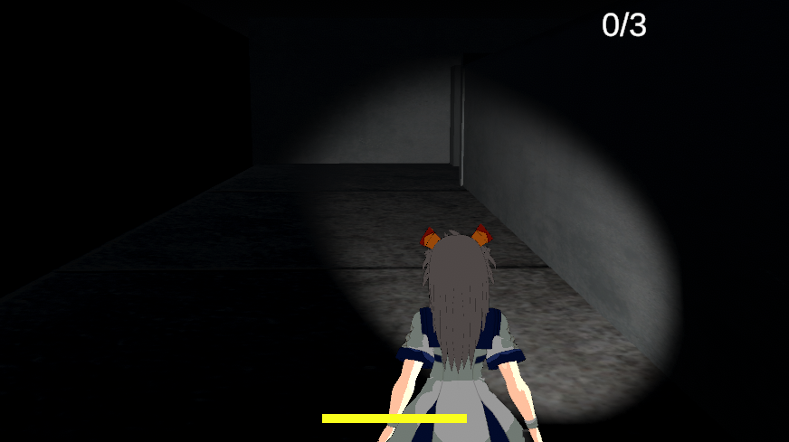

# ここにゲームのタイトルを記述する
LUMOS

## ゲームの内容
暗闇に包まれた地下に閉じ込められた主人公。ゾンビから逃げつつ、３つの鍵を探し脱出を目指します

## 操作説明
例
- WASDキーで前後移動できます。ライトの向きもWASDキーから動かせます（一体化している）
- シフトキーを押しながらWASDのいずれかのキーを押すとダッシュできます
- マウスで向きを移動できます。（視点の移動ではないです）
- マウス左クリックで落ちているカギをゲットできます
